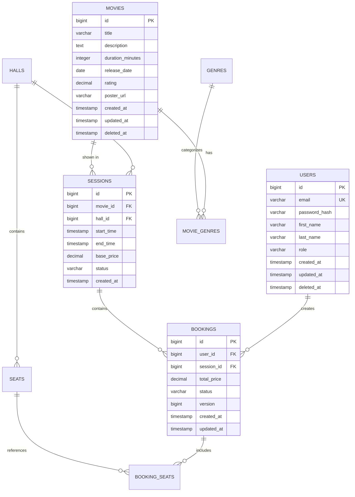

<div align="center">


[](https://git.io/typing-svg)

<br/>


<br/>

**National Technical University of Ukraine**
**"Igor Sikorsky Kyiv Polytechnic Institute"**

Database Management Systems Course Work | 2025

</div>

---

## Table of Contents

- [Overview](#overview)
- [Project Scope](#project-scope)
- [Technical Implementation](#technical-implementation)
- [Database Schema](#database-schema)
- [Installation](#installation)
- [API Endpoints](#api-endpoints)
- [Testing](#testing)
- [Academic Requirements](#academic-requirements)

---

## Overview

This repository contains a backend application for a cinema ticket booking system, implemented as a course work project for the Database Management Systems course at KPI. The application provides a RESTful API for managing cinema operations including movie catalog, screening sessions, hall configuration, and ticket reservations.

The system is built using Spring Boot framework with PostgreSQL as the primary database, demonstrating practical application of relational database design, SQL query optimization, transaction management, and concurrency control mechanisms.

## Project Scope

### Functional Requirements

The application implements the following business processes:

- **User Registration and Management**: User account creation with role-based access (USER/ADMIN), soft delete functionality for data preservation
- **Movie Catalog**: Movie information storage with genre associations, search capabilities, and release tracking
- **Hall Configuration**: Cinema hall definitions with multiple types (Standard 2D, Standard 3D, IMAX, VIP), seat layout management with configurable pricing
- **Session Scheduling**: Movie screening time slots with automatic overlap detection, status lifecycle management
- **Booking Operations**: Multi-seat reservation transactions with seat availability validation, price calculation, and booking status workflow
- **Analytics**: Basic revenue reporting and occupancy statistics

### Out of Scope

The following features are not implemented:
- Payment gateway integration
- User authentication/authorization (login system)
- Email notifications
- Frontend interface

---

## Technical Implementation

<div align="center">

| Component | Technology | Version | Purpose |
|-----------|-----------|---------|---------|
| **Runtime** | Java | 21 | Application runtime environment |
| **Framework** | Spring Boot | 3.4.1 | Backend application framework |
| **ORM** | Hibernate | 6.6.4 | Object-relational mapping |
| **Database** | PostgreSQL | 16 | Relational database system |
| **Migration** | Flyway | - | Database version control |
| **Build** | Gradle | 9.2.1 | Build automation |
| **Testing** | JUnit 5 + Testcontainers | - | Integration testing |
| **Containerization** | Docker Compose | - | Local development environment |

</div>

### Architecture

The application follows a layered architecture pattern:

```
┌─────────────────────────────────────┐
│     REST API Controllers Layer      │
├─────────────────────────────────────┤
│       Service/Business Logic        │
├─────────────────────────────────────┤
│    Repository/Data Access Layer     │
├─────────────────────────────────────┤
│      JPA/Hibernate (ORM Layer)      │
├─────────────────────────────────────┤
│         PostgreSQL Database         │
└─────────────────────────────────────┘
```

### Key Technical Features

**Transaction Management**
- `@Transactional` annotations for ACID compliance
- Read-only optimization for query-only operations
- Rollback handling for constraint violations

**Concurrency Control**
- Pessimistic locking (SELECT FOR UPDATE) for seat reservation operations to prevent double-booking
- Optimistic locking (@Version field) for booking status updates to handle concurrent modifications
- Transaction isolation to ensure data consistency

**Database Design Patterns**
- Soft delete implementation using `deleted_at` timestamp field with partial indexes
- Audit trail via automatic `created_at` and `updated_at` timestamps using database triggers
- Normalized schema (3rd Normal Form) to minimize data redundancy

**Performance Optimization**
- 13 database indexes covering common query patterns
- Pagination support for large result sets
- PostgreSQL full-text search using tsvector for movie title search
- Lazy loading for entity associations

---

## Database Schema

### Entity-Relationship Diagram

<div align="center">



</div>

### Table Overview

| Table Name | Rows (Estimated) | Primary Function | Key Constraints |
|------------|------------------|------------------|-----------------|
| `users` | Variable | Store user accounts | UNIQUE(email), CHECK(role IN valid values) |
| `genres` | ~10-20 | Reference data for movie categories | UNIQUE(name) |
| `movies` | 100-1000 | Movie catalog | CHECK(rating BETWEEN 0 AND 10), CHECK(duration > 0) |
| `movie_genres` | 200-2000 | Many-to-many movie-genre relationship | PK(movie_id, genre_id), CASCADE DELETE |
| `halls` | 5-15 | Cinema hall definitions | UNIQUE(name), CHECK(capacity > 0) |
| `seats` | 500-2000 | Individual seat records | UNIQUE(hall_id, row_number, seat_number) |
| `sessions` | 50-500 | Screening schedules | CHECK(end_time > start_time), CHECK(base_price >= 0) |
| `bookings` | 1000-10000 | Reservation records | CHECK(total_price >= 0), VERSION column |
| `booking_seats` | 2000-30000 | Seat-booking associations | CHECK(price >= 0), CASCADE DELETE |

### Indexes

13 indexes are defined for query optimization:

- B-tree indexes on foreign keys and frequently queried columns
- Composite indexes for multi-column queries (e.g., `hall_id + start_time + end_time`)
- Partial indexes for soft-deleted records (`WHERE deleted_at IS NULL`)
- GIN index for full-text search on movie titles

### Database Constraints

- 8 CHECK constraints for business rule enforcement
- Foreign key constraints with appropriate CASCADE/RESTRICT actions
- NOT NULL constraints on required fields
- UNIQUE constraints on business keys

---

## Installation

### Prerequisites

- JDK 21 or higher
- Docker and Docker Compose
- Git

### Setup Instructions

1. Clone the repository:
```bash
git clone https://github.com/Aligheri/cinema-booking-system.git
cd cinema-booking-system
```

2. Start PostgreSQL using Docker Compose:
```bash
docker-compose up -d postgres
```

3. Build the project:
```bash
./gradlew clean build
```

4. Run the application:
```bash
./gradlew bootRun
```

The application will be available at `http://localhost:8080`

### Database Migrations

Flyway automatically applies database migrations on application startup. Migration files are located in `src/main/resources/db/migration/`:

- `V1__create_tables.sql` - Table creation with constraints and triggers
- `V2__create_indexes.sql` - Index definitions
- `V3__seed_data.sql` - Initial reference data

### Docker Deployment

To run the complete stack:
```bash
docker-compose up -d
```

This starts both PostgreSQL (port 5433) and the Spring Boot application (port 8080).

---

## API Endpoints

Base URL: `http://localhost:8080/api/v1`

Interactive API documentation is available at `http://localhost:8080/swagger-ui.html`

### Users

| Method | Endpoint | Description |
|--------|----------|-------------|
| POST | `/users` | Create new user account |
| GET | `/users/{id}` | Retrieve user by ID |
| GET | `/users/email/{email}` | Find user by email address |
| GET | `/users?page={n}&size={m}` | List users with pagination |
| DELETE | `/users/{id}` | Soft delete user account |

### Movies

| Method | Endpoint | Description |
|--------|----------|-------------|
| POST | `/movies` | Create new movie entry |
| GET | `/movies` | List all movies |
| GET | `/movies/{id}` | Get movie details with genres |
| GET | `/movies/search?title={query}` | Search movies by title (LIKE) |
| GET | `/movies/search/fulltext?q={query}` | Full-text search |
| GET | `/movies/genre/{genreId}` | Filter movies by genre |
| GET | `/movies/now-showing?page={n}` | Currently showing movies |
| DELETE | `/movies/{id}` | Soft delete movie |

### Sessions

| Method | Endpoint | Description |
|--------|----------|-------------|
| POST | `/sessions` | Create screening session |
| GET | `/sessions/{id}` | Get session details |
| GET | `/sessions/schedule?date={YYYY-MM-DD}` | Daily screening schedule |
| GET | `/sessions/movie/{movieId}/upcoming` | Upcoming sessions for movie |
| PUT | `/sessions/{id}/cancel` | Cancel session |

### Bookings

| Method | Endpoint | Description |
|--------|----------|-------------|
| POST | `/bookings` | Create new booking (requires seatIds array) |
| GET | `/bookings/{id}` | Get booking details |
| GET | `/bookings/user/{userId}?page={n}` | User booking history |
| PUT | `/bookings/{id}/status` | Update booking status |

### Analytics

| Method | Endpoint | Description |
|--------|----------|-------------|
| GET | `/analytics/movies/revenue?limit={n}` | Top N movies by revenue |
| GET | `/analytics/sessions/occupancy` | Session occupancy statistics |
| GET | `/analytics/revenue/daily?days={n}` | Revenue for last N days |

---

## Testing

The project includes integration tests using Testcontainers to run tests against a real PostgreSQL instance.

### Run Tests

```bash
./gradlew test
```

### Test Structure

```
src/test/java/org/example/db_project/
├── BaseIntegrationTest.java              # Base test configuration
├── PostgresTestContainer.java            # Singleton container
├── repository/
│   └── RepositoryIntegrationTest.java   # Repository layer tests
└── service/
    ├── BookingServiceIntegrationTest.java
    ├── MovieServiceIntegrationTest.java
    ├── SessionServiceIntegrationTest.java
    └── UserServiceIntegrationTest.java
```

Tests verify:
- Repository query correctness
- Service layer business logic
- Transaction rollback scenarios
- Concurrency handling (pessimistic/optimistic locking)
- Constraint validation
- Soft delete functionality

---

## Academic Requirements

### Course Information

- **University**: National Technical University of Ukraine "Igor Sikorsky Kyiv Polytechnic Institute"
- **Course**: Database
- **Work Type**: Course Project
- **Year**: 2025

### Demonstrated Competencies

**Database Design and Normalization**
- Entity-relationship modeling with 9 normalized tables
- 3rd Normal Form (3NF) compliance to eliminate redundancy
- Appropriate use of surrogate keys (BIGSERIAL primary keys)
- Proper foreign key relationships with referential integrity

**SQL Proficiency**
- Complex queries with multiple joins
- Aggregate functions and grouping
- Subqueries and Common Table Expressions (CTEs)
- Window functions for analytics
- Full-text search implementation

**Transaction Management**
- ACID property enforcement through proper transaction boundaries
- Isolation level understanding (default READ COMMITTED)
- Explicit transaction demarcation using `@Transactional`
- Rollback handling for constraint violations

**Concurrency Control**
- Pessimistic locking using SELECT FOR UPDATE (seat reservation)
- Optimistic locking using version fields (booking updates)
- Understanding of lock acquisition and deadlock prevention

**Database Administration**
- Schema migration using Flyway
- Index design for query optimization
- Constraint definition (CHECK, FOREIGN KEY, UNIQUE)
- Trigger creation for audit trail automation

**ORM Framework Usage**
- JPA entity mapping with proper annotations
- Relationship mapping (OneToMany, ManyToOne, ManyToMany)
- Lazy loading configuration
- Custom query methods using @Query annotation
- Native SQL queries where ORM is insufficient

**Integration Testing**
- Testcontainers for database testing
- Test data management
- Transaction rollback in tests
- Verification of database state changes

### Project Structure

```
cinema-booking-system/
├── src/
│   ├── main/
│   │   ├── java/org/example/db_project/
│   │   │   ├── config/              # Application configuration
│   │   │   ├── controller/          # REST API layer
│   │   │   ├── domain/
│   │   │   │   ├── entity/          # JPA entities (database tables)
│   │   │   │   ├── enums/           # Enumeration types
│   │   │   │   └── repository/      # Data access layer
│   │   │   ├── dto/                 # Request/response DTOs
│   │   │   ├── exception/           # Exception handling
│   │   │   └── service/             # Business logic layer
│   │   └── resources/
│   │       ├── db/migration/        # Flyway SQL migrations
│   │       └── application.properties
│   └── test/                        # Integration tests
├── docs/
│   └── ERD_cinema.png              # Entity-relationship diagram
├── docker-compose.yml              # Docker services definition
├── Dockerfile                      # Application container
└── build.gradle                    # Gradle build configuration
```

---


<div align="center">


**National Technical University of Ukraine "Igor Sikorsky Kyiv Polytechnic Institute"**

2025

</div>
